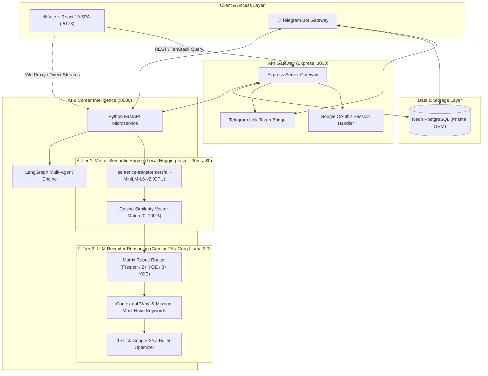
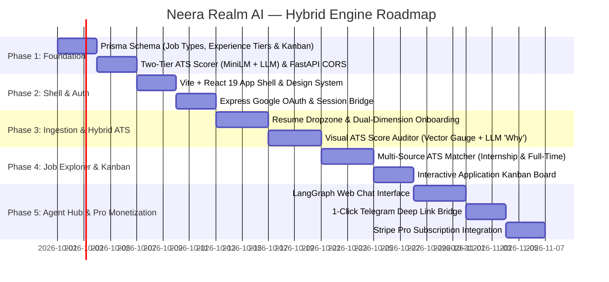

# 📋 Neera Realm AI — Web Platform Master Plan & Technical Roadmap
**Document Version:** 2.0.0  
**Role:** Lead Technical Project Manager & Solutions Architect  
**Architecture:** Vite + React 19 SPA + Express Gateway + Python FastAPI Microservice  
**Core Innovation:** Two-Tier Hybrid ATS Engine (Local Vector Embeddings + LLM Recruiter Assistant)  
**Evaluation Matrix:** Decoupled Experience Tiers (Fresher, 2+ YOE, 3+ YOE) x Job Types (Internship, Full-Time)  
**Companion Channels:** Telegram Bot Assistant & Webhook Notifications  
**Status:** Approved for Phased Execution (Hybrid Vector + LLM Architecture)  

---

## 1. Executive Summary & Strategic Positioning

Neera Realm AI is expanding from a Telegram assistant into an enterprise-grade **Career Intelligence & ATS Optimization SaaS**. 

A core differentiator is our **Two-Tier Hybrid ATS Scoring Engine**, mirroring the architectural standard deployed by tier-1 ATS platforms (Greenhouse, Eightfold.ai, and Ashby):
1. **Tier 1: High-Speed Vector Semantic Layer (Local Hugging Face `all-MiniLM-L6-v2`)**: Computes dense vector embeddings of the resume and job description to calculate instant cosine similarity in **30 milliseconds on CPU for $0.00**. Natively maps technical synonyms (`K8s` ➔ `Kubernetes`, `Postgres` ➔ `Relational DB`).
2. **Tier 2: Deep LLM Recruiter Reasoning Layer (Gemini 2.5 / Groq Llama 3.3)**: Acts as an autonomous recruiter assistant. Provides qualitative explanations (the "Why"), extracts exact missing must-have keywords from the JD, and generates 1-click tailored bullet rewrites using Google's XYZ formula.

### Decoupled Matrix Dimensions:
```
┌─────────────────────────────────────────────────────────────────────────────┐
│                              TARGET JOB TYPES                               │
│                 [ Internship ]             [ Full-Time ]                    │
├─────────────────────────────────────────────────────────────────────────────┤
│  EXPERIENCE TIERS:                                                          │
│  1. Fresher / Entry Level (0-1 YOE) ──> Eligible for BOTH Intern & Full-Time│
│  2. Mid-Level (2+ YOE)              ──> Full-Time Software Engineer         │
│  3. Senior / Lead (3+ YOE)          ──> Full-Time Senior / Lead Engineer    │
└─────────────────────────────────────────────────────────────────────────────┘
```

### Architectural Topology:


---

## 2. The Two-Tier Hybrid ATS Engine Explained

### 2.1 Why Pure LLMs or Pure Keyword Checkers Fail
- **Pure Keyword ATS (Legacy)**: Dumb string matching. If a JD says "Kubernetes" and a candidate wrote "K8s" or "Container Orchestration", they get rejected.
- **Pure LLM ATS**: Slow (3–6 seconds) and expensive. Running an LLM over every resume/job comparison burns API limits and causes lag.
- **Our Hybrid Solution**: Combine instant mathematical vector similarity (sub-50ms) with deep qualitative LLM reasoning.

### 2.2 Tier 1: Vector-Based Semantic Search Engine
- **Model**: `sentence-transformers/all-MiniLM-L6-v2` (Hugging Face).
- **Footprint**: 80MB model running in-memory on CPU in `ai_service/`. Requires 0 GPU VRAM.
- **Cost**: **$0.00 forever**.
- **Role**:
  - Converts Resume text and Job Description text into 384-dimensional dense vectors.
  - Computes mathematical **Cosine Similarity** in **30 milliseconds**.
  - Maps domain synonyms without explicit rules (`FastAPI` ➔ `Python Web Framework`, `PostgreSQL` ➔ `SQL Database`, `GCP` ➔ `Cloud Infrastructure`).
  - Immediately displays the baseline **Semantic Alignment Meter (0–100%)** on the web dashboard.

### 2.3 Tier 2: LLM Recruiter Assistant (The "Why" & The Fix)
- **Engine**: Gemini 2.5 Pro/Flash or Groq Llama 3.3 70B (pluggable via `.env`).
- **Role**:
  - **Contextual Justification (The "Why")**: Pinpoints exactly why the candidate fits or where gaps exist (e.g. *"Candidate has strong React frontend skills, but lacks the 2 years of distributed systems and Kafka required in this JD"*).
  - **Keyword Delta Matrix**: Categorizes keywords into:
    - 🟢 **Matched Skills**
    - 🔴 **Missing Critical Must-Haves**
    - 🟡 **Missing Nice-to-Haves / Bonus Tools**
  - **1-Click Tailored Bullet Rewriter**: Rephrases the candidate's existing experience using the **Google XYZ Formula** (*"Accomplished [X] as measured by [Y], by doing [Z]"*) specifically targeting this JD's requirements.

---

### 2.4 The Matrix Evaluation Rubrics (Experience x Job Type)

| Candidate Track & Target | Tier 1: Vector Focus | Tier 2: LLM Evaluation Priorities | External Signals |
| :--- | :--- | :--- | :--- |
| **🎓 Fresher / Entry-Level targeting Full-Time** | Semantic overlap between project descriptions and JD tech stack. | **Production Readiness (35%)**, CS fundamentals & data structures (25%), code quality & GitHub (20%), academics/contests (10%), ATS formatting (10%). | Active GitHub signal verification (commits, repos, PRs). |
| **🌱 Candidate targeting Internship** | Foundational programming language and coursework match. | **Learning Velocity & Curiosity (40%)**, programming basics (30%), hackathons & coursework (15%), extracurriculars (15%). | Encouraged signal (boosts score for active GitHub projects). |
| **⚡ Mid-Level (2+ YOE) targeting Full-Time** | Stack depth and production tooling alignment. | **Autonomous Feature Ownership (35%)**, framework mastery (25%), automated testing/CI/CD (20%), business scalability (15%), format (5%). | Optional value booster (+5 pts). Zero penalty for enterprise code. |
| **🏆 Senior (3+ YOE) targeting Full-Time** | Architectural terminology and systems-level scope. | **Systems Scale & Architecture (40%)**, quantifiable business metrics (25%) (latency, cost, throughput), stack depth (20%), leadership (10%), brevity (5%). | Optional value booster (+5 pts). Zero penalty for closed-source work. |

---

## 3. Technology Stack Selection

| Domain | Selected Tool | Architectural Justification |
| :--- | :--- | :--- |
| **Frontend Framework** | **Vite + React 19 (TypeScript)** | Zero SSR hydration errors, instant HMR, full creative freedom for 60fps animations. |
| **Styling & Theme** | **Tailwind CSS v4** | CSS-first configuration, fluid responsive breakpoints, dark-mode native tokens. |
| **Component Primitives** | **Shadcn UI (Radix UI)** | Accessible, unstyled primitives delivering a sleek, Linear-grade SaaS interface. |
| **Animations & Visuals** | **Framer Motion + Lucide** | Smooth tab transitions, animated circular gauges, and interactive card hover states. |
| **Data Viz & Gauges** | **Recharts** | Radial ATS score meters (0–100%), skill radar charts, and salary distribution curves. |
| **Drag & Drop** | **@dnd-kit/core** | High-performance Kanban board for job applications (`Saved` ➔ `Applied` ➔ `Offer`). |
| **PDF Ingestion & Viewer** | **react-dropzone** + **pdfjs-dist** | Validated drag-and-drop resume ingestion with split-screen PDF preview. |
| **Client Caching & State** | **TanStack Query v5 + Zustand** | Caching live job queries, optimistic UI updates, and lightweight filter management. |
| **Backend Gateway** | **Express 5 + Prisma ORM** | Handles Google OAuth, session cookies, Neon PostgreSQL data mutations, and Telegram link tokens. |
| **Vector Embedding Engine** | **Hugging Face `all-MiniLM-L6-v2`** | 80MB local model in Python; 30ms Cosine Similarity calculations for $0.00. |
| **LLM Recruiter Engine** | **Gemini 2.5 / Groq Llama 3.3** | Qualitative reasoning, keyword gap matrix, and 1-click Google-XYZ bullet rewrites. |
| **Monetization** | **Stripe Node SDK** | Stripe Checkout & Customer Portal for $12/mo or $99/yr Pro tier subscriptions. |

---

## 4. Seamless 5-Phase Implementation Master Plan



---

### 🟢 Phase 1: Database & Hybrid ATS Backend Readiness
**Dependency:** `prisma/schema.prisma` and `ai_service/app/main.py`.  
**Deliverables:**
1. **Prisma Schema Update (`prisma/schema.prisma`)**:
   - `telegramId BigInt? @unique` (optional for web-first signups).
   - `email String @unique`, `image String?` (OAuth user avatar).
   - `experienceLevel String?` (`"Fresher / Entry-Level"`, `"2+ Years"`, `"3+ Years"`).
   - `jobTypes String[] @default(["Full-Time"])` (`["Internship"]`, `["Full-Time"]`, `["Both"]`).
   - `telegramLinkToken String?`, `telegramLinkExpires DateTime?`.
   - `JobApplication` model for Kanban tracking (`id`, `userId`, `jobTitle`, `companyName`, `jobType`, `status`, `notes`).
2. **Two-Tier Hybrid ATS Scorer (`ai_service/app/services/ats_scorer.py`)**:
   - **Tier 1**: Embeddings via `sentence-transformers/all-MiniLM-L6-v2` returning instant `vector_similarity_score` (0–100%).
   - **Tier 2**: Structured LLM evaluation returning:
     - `overall_match_score` (blended vector + rubric score)
     - `contextual_why` (plain-language recruiter explanation)
     - `matched_keywords`, `missing_must_haves`, `missing_nice_to_haves`
     - `bullet_rewrites` (Google-XYZ formula)
   - Anti-prompt-injection sanitizer.
   - Endpoint: `POST /api/v1/resume/score`.
3. **CORS Configuration**: Enable `http://localhost:5173` and production web URLs in FastAPI.

---

### 🟢 Phase 2: Web Application Shell, Public Landing Page & Auth
**Dependency:** Phase 1 (Schema & DB push).  
**Deliverables:**
1. **Vite + React 19 Directory Initialization (`web/`)**:
   - React 19, TypeScript, Tailwind CSS v4, Shadcn UI setup.
   - Vite Proxy forwarding `/api` to Express (`:3000`) and `/ai` to FastAPI (`:8000`).
2. **Public High-Converting Landing Page**:
   - Hero: "The Autonomous Career Agent for Tech Professionals & Freshers".
   - Live Instant ATS Teaser: Free dropzone computing instant vector similarity without registration.
   - Experience Tier & Job Type Switcher: Demonstrates adaptive scoring.
3. **Google OAuth & Session Bridge**:
   - Connect frontend to Express `src/services/authService.ts`.
   - React Auth Context storing authenticated user state.

---

### 🟢 Phase 3: Interactive Career Ingestion & Hybrid ATS Auditor
**Dependency:** Phase 2 (Authenticated User Session).  
**Deliverables:**
1. **Resume Dropzone & Matrix Onboarding (`ResumeDropzone.tsx`)**:
   - Validates PDF (< 5MB), uploads to `POST /api/v1/resume/parse`.
   - Candidate confirms Experience Tier and Job Type.
   - Stores parsed profile into `users.resumeJson`, `users.experienceLevel`, and `users.jobTypes`.
2. **Visual ATS Score & Critique Dashboard (`AtsAuditDashboard.tsx`)**:
   - Instant Vector Similarity Gauge (renders in 30ms).
   - Recruiter Explanation Card (The "Why" plain-text explanation).
   - Keyword Delta Matrix (Green = Matched, Red = Missing Must-Haves, Yellow = Missing Nice-to-Haves).
   - 1-Click Bullet Rewriter with side-by-side diff preview.

---

### 🟢 Phase 4: Intelligent Job Discovery Board & Kanban Pipeline
**Dependency:** Phase 3 (Verified User Profile).  
**Deliverables:**
1. **Multi-Source ATS Job Discovery Board**:
   - Queries Greenhouse, Lever, Ashby, Remotive, and Arbeitnow.
   - Dual-dimension filters: Internship vs Full-Time; Experience level; Remote only; Freshness.
   - 1-Click "Match My Resume" button on every job card.
2. **Drag-and-Drop Application Kanban (`@dnd-kit/core`)**:
   - Pipeline stages: `Saved` ➔ `Applied` ➔ `Interviewing` ➔ `Offer` ➔ `Archived`.
   - Application modal: Notes, interview checklist, tailored cover letter.

---

### 🟢 Phase 5: Agent Chat Hub, Telegram Companion Sync & Pro Monetization
**Dependency:** Phases 1–4.  
**Deliverables:**
1. **LangGraph Web Chat Interface**:
   - Streaming conversational interface connected to Master Supervisor (`/api/v1/orchestrate`).
   - Morning briefing widget: Market watchlist + Google Calendar meetings + Top 3 matching jobs.
2. **1-Click Telegram Companion Linking**:
   - Deep link: `https://t.me/NeeraRealmBot?start=link_<token>`.
   - Syncs account so all live ATS job alerts hit Telegram directly.
3. **Stripe Pro Monetization**:
   - $12/month or $99/year subscription for unlimited deep ATS audits, tailored cover letters, and real-time dream company monitoring.

---

## 5. Commercial Freemium & Monetization Matrix

| Feature | 🆓 Free Tier | ⭐ Pro Tier ($12 / Month) |
| :--- | :--- | :--- |
| **Instant Vector Score** | Unlimited (Instant 30ms similarity) | Unlimited |
| **Recruiter "Why" Explanation** | Top 2 bullet points | Full Deep Contextual Justification |
| **Keyword Delta Analysis** | Top 3 Missing Keywords | Complete Keyword Matrix & Density Check |
| **1-Click Google-XYZ Bullet Rewriter** | 1 sample rewrite | Unlimited tailored bullet rewrites |
| **GitHub Profile Verification** | ❌ None | ✅ Deep commit frequency, repo stars & PR audit |
| **Target Company Job Alerts** | Daily via Telegram (Standard) | Instant alerts (< 15 mins) on Greenhouse/Lever/Ashby |
| **Job Application Kanban** | Up to 10 active jobs | Unlimited active applications + tailored cover letters |

---

## 6. Next Immediate Execution Step

**Kickoff Phase 1 (WP 1.1)**:
1. Update `prisma/schema.prisma` with `telegramId?`, `email`, `experienceLevel`, `jobTypes`, and `JobApplication`.
2. Run `npx prisma db push`.
3. Implement `ai_service/app/services/ats_scorer.py` featuring the Two-Tier Hybrid ATS Engine (`all-MiniLM-L6-v2` + LLM).
