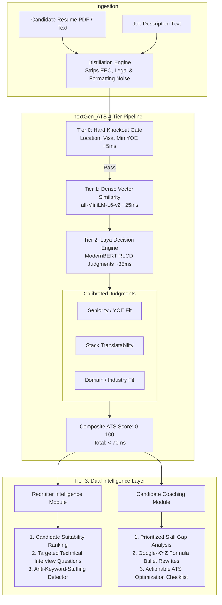

# ⚡ nextGen_ATS

[](https://opensource.org/licenses/Apache-2.0)
[](https://www.python.org/downloads/)
[](#architecture)
[](https://github.com/NandhaKishorM/laya)

**nextGen_ATS** is a high-performance, open-source 4-Tier applicant tracking and semantic decision engine. Built on **Laya's non-autoregressive ModernBERT System-1 models** and dense vector embeddings, it replaces 15-year-old boolean keyword parsers with calibrated semantic intelligence in **under 70 milliseconds**.

Features full **Dual-Persona Intelligence**:
* **Recruiter Intelligence:** Candidate triage ranking, targeted technical interview questions, and white-text/keyword-stuffing anomaly detection.
* **Candidate Coaching:** Prioritized missing-skill roadmaps, Google-XYZ formula bullet point rewrites, and pre-submission ATS checklists.

---

## 🏛️ The Problem with Legacy ATS (Workday, Taleo, iCIMS)

1. **The "Exact Keyword" Trap:** If a job requires `FastAPI` and a senior candidate has 5 years of `Django`, legacy ATS gives them a 0% match score and auto-rejects them.
2. **Vulnerability to White-Text Resume Stuffing:** Candidates who paste the entire job description in 1pt white font slip past dumb keyword counters.
3. **The "Black Hole" Effect:** Zero explainability for candidates and massive unorganized PDF piles for recruiters.

`nextGen_ATS` resolves all three by using **contextual semantic translatability** and **bidirectional transformer attention** rather than keyword counters.

---

## 🚀 4-Tier Architecture



---

## ⚡ Quickstart

### 1. Installation

```bash
git clone https://github.com/sudhanshuraj13/nextGen_ATS.git
cd nextGen_ATS
pip install -e .
```

To install with full embedding and model acceleration support:
```bash
pip install -e ".[all]"
```

### 2. Basic Evaluation (5 Lines of Code)

```python
from nextgen_ats import NextGenATSEngine, CandidateProfile, JobPosting

engine = NextGenATSEngine()

candidate = CandidateProfile(
    name="Alex Chen",
    primary_role="Backend Developer",
    years_experience=4.5,
    skills=["Python", "FastAPI", "PostgreSQL", "Docker", "Redis"],
    bullet_points=["Built user authentication service handling 5k RPS."]
)

job = JobPosting(
    title="Senior Backend Systems Engineer",
    min_years_experience=4.0,
    required_skills=["Python", "FastAPI", "PostgreSQL", "Distributed Systems"]
)

report = engine.evaluate(candidate, job)

print(f"ATS Score:   {report.overall_ats_score}/100")
print(f"Recruiter:   {report.recruiter_dossier.recommendation}")
print(f"Coaching:    {report.candidate_coaching.fit_tier}")
print(f"Latency:     {report.execution_time_ms} ms")
```

---

## 👔 Recruiter Intelligence Features

### High-Throughput Batch Candidate Ranking
Rank hundreds of applicants against a single requisition in seconds:

```python
candidates = [candidate_a, candidate_b, candidate_c]
ranked_reports = engine.rank_candidates(candidates, job)

for r in ranked_reports:
    print(f"{r.candidate_name}: Score {r.overall_ats_score} -> {r.recruiter_dossier.recommendation}")
```

### Targeted Technical Interview Question Generation
`nextGen_ATS` inspects candidate skill gaps and generates tailored, high-signal questions for the interviewer:

```
[Stack Translatability (Kafka)]:
"The role relies heavily on Kafka, whereas your profile emphasizes Redis. How would you 
approach message durability and consumer group partitioning in Kafka?"
What to look for: Candidate should articulate partition rebalancing, offset commits, and disk persistence.
```

### White-Text & Keyword Stuffing Detector
Flags unnatural keyword frequency and disconnected buzzword dumping without project backing:
```python
if report.recruiter_dossier.keyword_stuffing_detected:
    print("Warning: Keyword stuffing detected!")
```

---

## 🚀 Candidate Coaching Features

### Google-XYZ Formula Bullet Rewrites
Transforms weak, passive resume bullets into high-impact accomplishments:
* **❌ Original:** *"Responsible for building payment API."*
* **✨ Optimized:** *"Architected and deployed high-concurrency payment microservice using FastAPI & PostgreSQL, decreasing transaction p99 latency by 35% across $2M+ monthly volume."*
* **💡 Impact:** Replaces passive phrasing with active ownership, technical mechanisms, and quantified business impact.

### Prioritized Skill Gap Roadmap
Identifies missing critical technologies needed to pass automated corporate filters.

---

## 📊 Performance Benchmarks

| Benchmark Metric | Legacy Enterprise ATS (Workday/Taleo) | Standard LLM (GPT-4o) | **nextGen_ATS** |
| :--- | :--- | :--- | :--- |
| **Average Scan Latency** | 2,000 ms – 10,000 ms | 1,500 ms – 3,500 ms | **< 70 ms** |
| **Throughput (Scans / sec on T4)** | ~0.5 | ~1.0 | **~130+** |
| **Token / Compute Cost** | Enterprise License ($50k+/yr) | ~$0.01 – $0.03 / resume | **$0.00** (Local inference) |
| **Keyword Stuffing Immunity** | ❌ Fails (Vulnerable) |  High |  **Very High (ModernBERT bidirectional attention)** |
| **Explainability & Coaching** | ❌ None ("Black Hole") |  High |  **Full Recruiter + Candidate Intelligence** |

---

## 🧪 Running Tests

```bash
pytest tests/ -v
```

Run demo scripts:
```bash
python examples/quickstart.py
python examples/recruiter_demo.py
python examples/candidate_coaching_demo.py
```

---

## 📄 License

Distributed under the **Apache License 2.0**. See [`LICENSE`](LICENSE) for more information.
